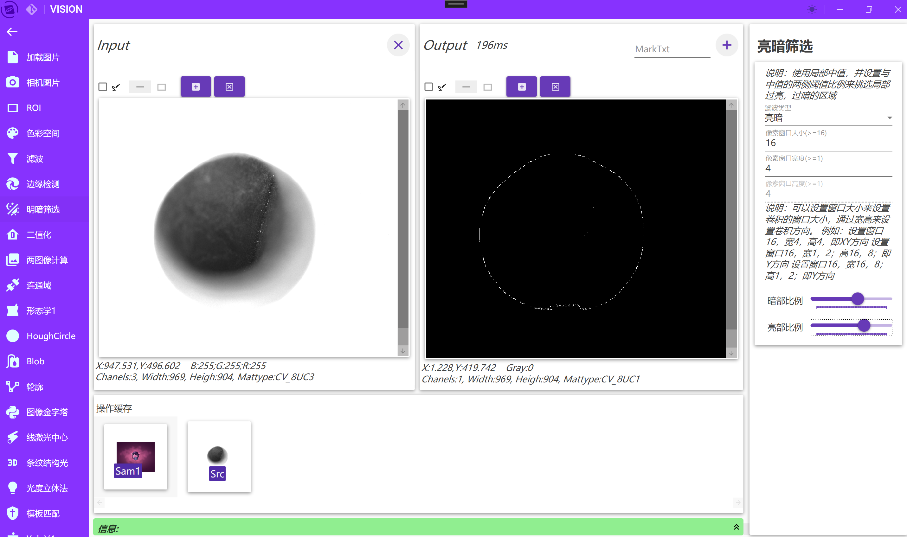
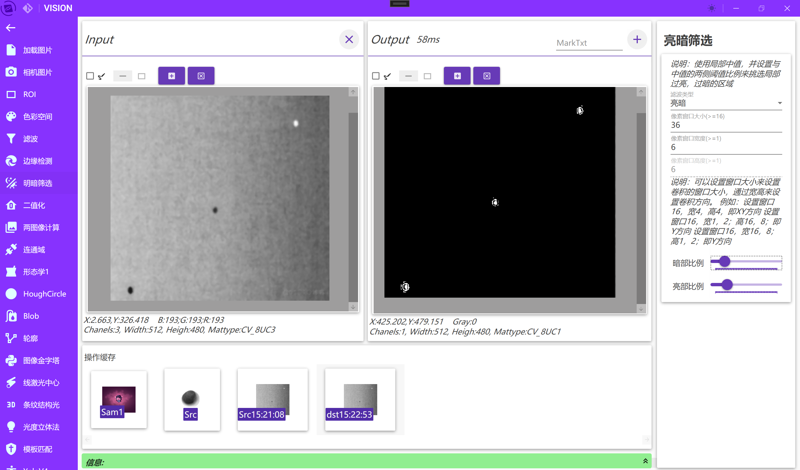
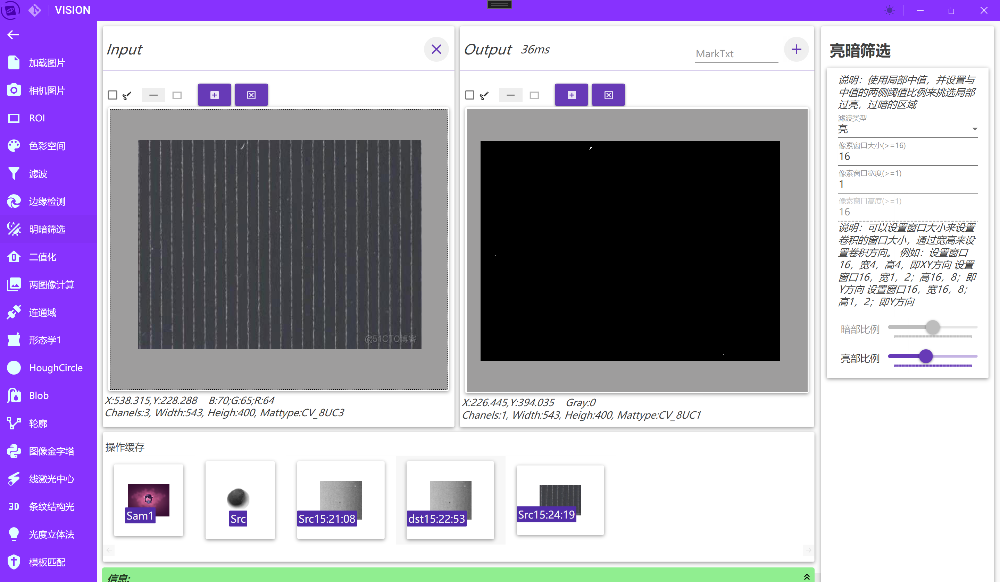
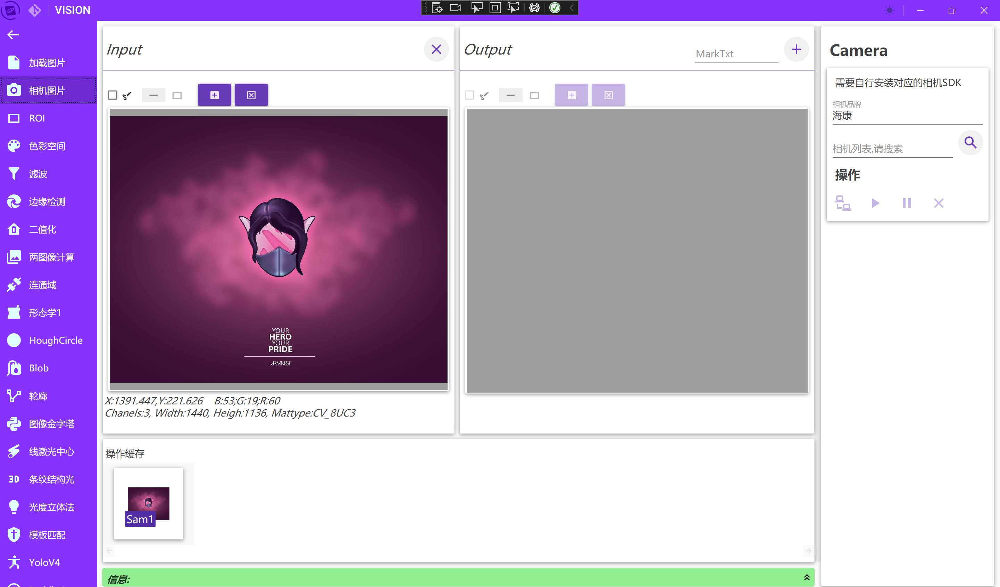
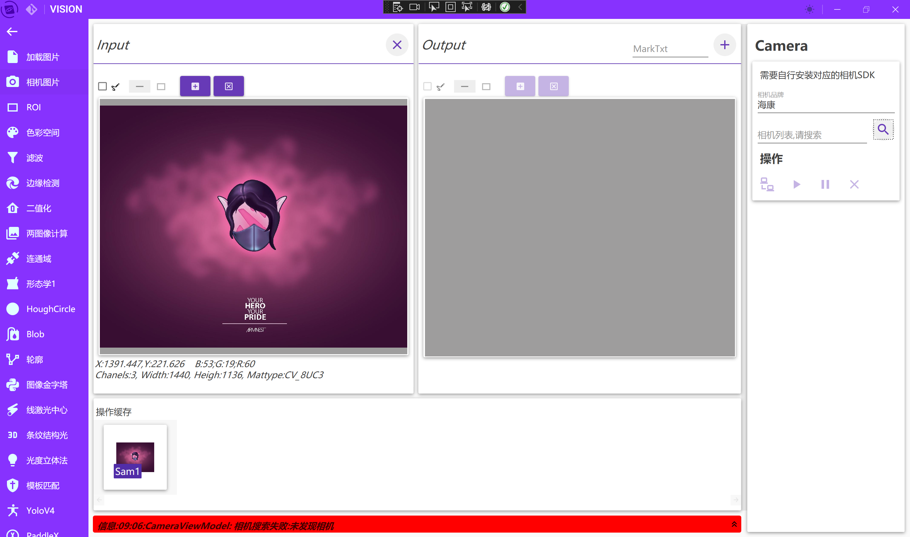
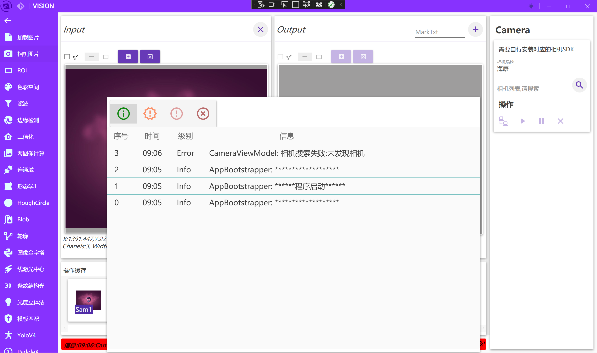
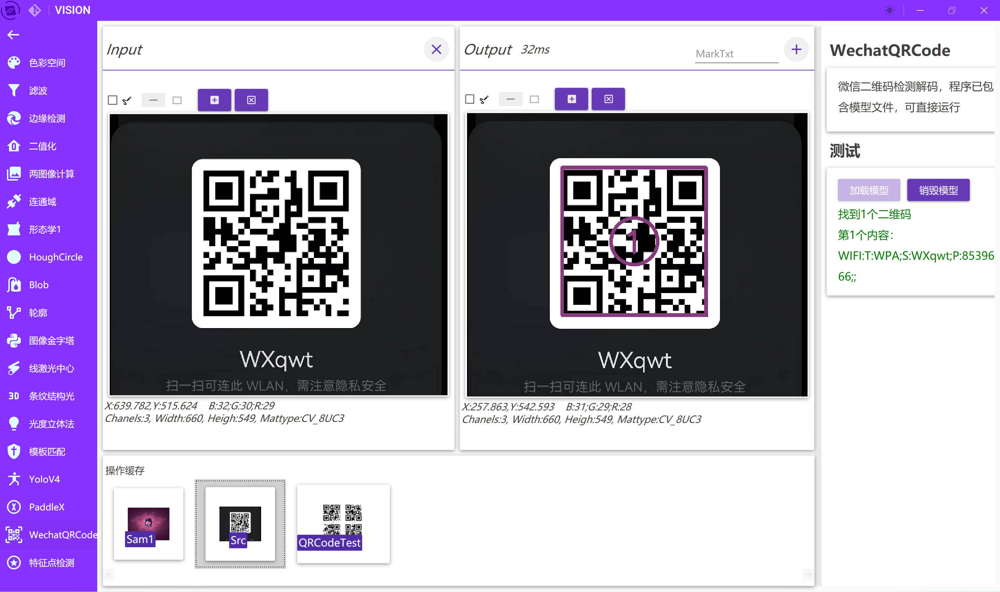
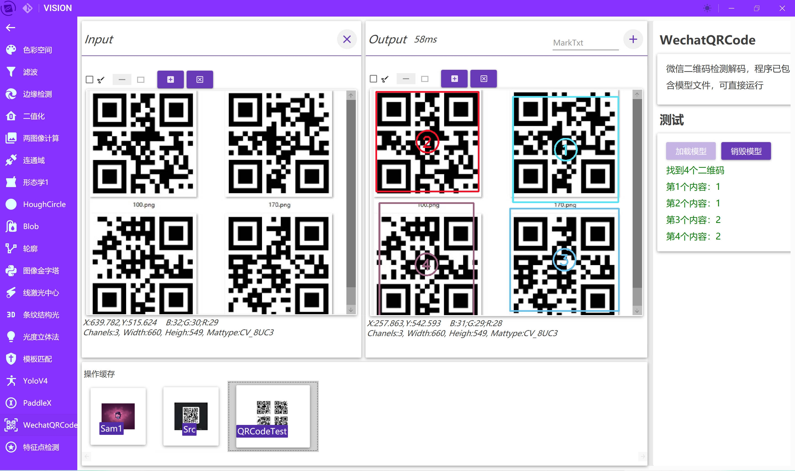
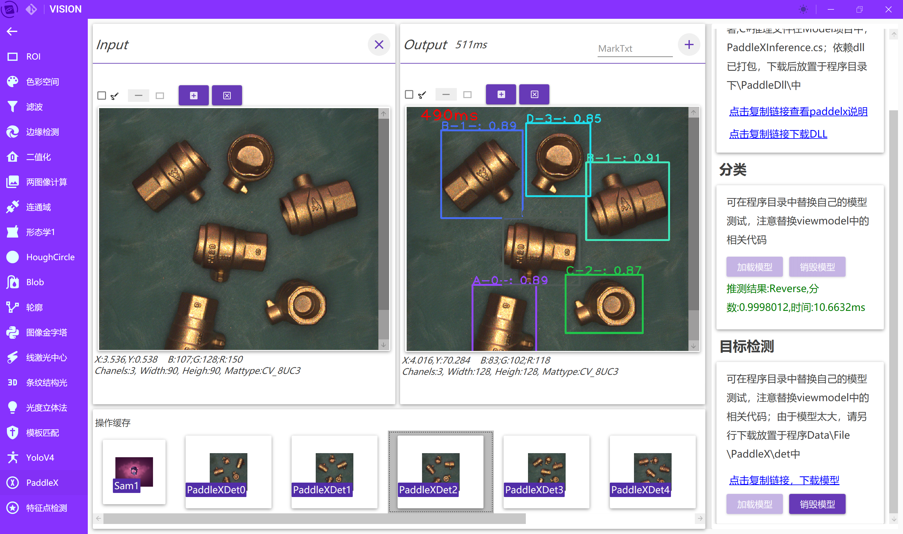

# OpencvVision

## 是什么？

这是一个使用.net 6基于OpencvSharp、ReactiveUI开发的自用工具，主要用来做ReactiveUI与OpencvSharp学习过程中的尝试；根据个人需求不定期更新添加功能，欢迎讨论交流。

### ！其他信息请参考项目OpenCVVision.View内AppBootstrapper.cs文件里的相关说明

## 引用

| 功能          | 引用包                                                                                                |
| ----------- | -------------------------------------------------------------------------------------------------- |
| OpencvSharp | [OpencvSharp](https://github.com/shimat/opencvsharp_samples)                                       |
| MVVMk框架     | [ReactiveUI](https://github.com/reactiveui/ReactiveUI)                                             |
| 界面控件        | [MaterialDesignInXamlToolkit](https://github.com/MaterialDesignInXAML/MaterialDesignInXamlToolkit) |
| 标题栏         | [MahApps.Metro](https://github.com/MahApps/MahApps.Metro)                                          |
| 响应式集合       | [DynamicData](https://github.com/reactivemarbles/DynamicData)                                      |
| 返回结果包装      | [FluentResults](https://github.com/altmann/FluentResults)                                          |

## 推荐

> 其它项目： 
> [OpenCVSharpHelper](https://gitee.com/tfarcraw/opencvsharphelper)

## 部分功能截图

### 22/09/08更新2

从朋友处了解到基恩士的浓淡补正算法，感觉挺有意思，查找了下相关的资料，尝试简单的实现一下明暗局部的筛选。思路是选取一个卷积核，进行滑移，规则是先排列挑出核内部的中值，在通过设置删除亮暗比例设置中值附近的阈值，来筛选出局部过亮或过暗的部分；可以通过卷积核长宽设置方向，来实现特定方向的筛选，示意如下图：
筛选出不均匀的边缘

筛选出中间的过亮部分和过暗部分

沿着Y方向，筛选出过亮部分，因为选定了方向，条纹不会被选出,仅选出非条纹的亮线

### 22/09/08更新1

调整解决方案项目目录，新增服务子项目
添加海康，大恒相机采集图像。需要自行安装对应品牌SDK。由以往项目中使用程序汇总而来，暂时不具备测试条件，等待后续测试硬件。
添加信息栏，根据日志等级变换背景颜色

添加日志面板，点击信息栏右侧按钮展开，点击其它空白区域丢失焦点关闭

### 22/06/21更新

微信二维码检测解码

### 22/06/20更新

PaddleX图像分类推理

PaddleX目标检测推理

### 功能

首页

夜间模式添加图片

ROI

色彩空间

滤波

二值化

形态学

连通域

轮廓

格雷码条纹结构光

灰度质心线激光

光度立体法求表面法线与深度图

Yolo识别

特征点匹配

