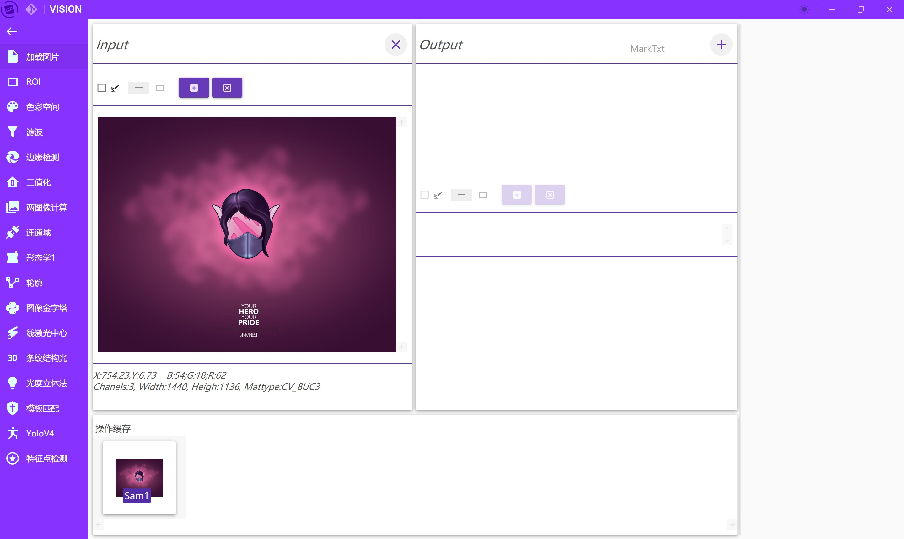
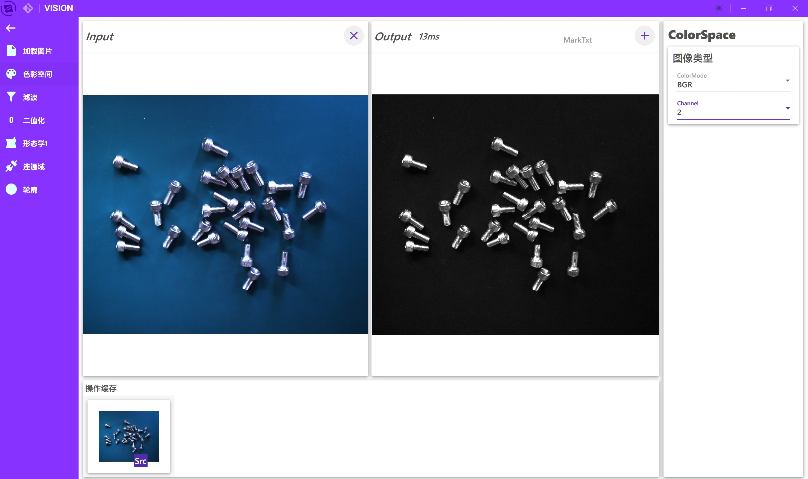
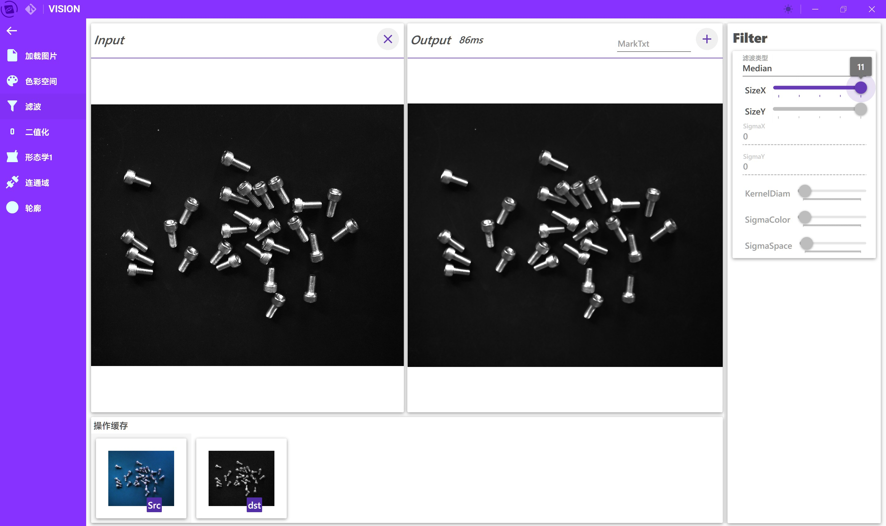
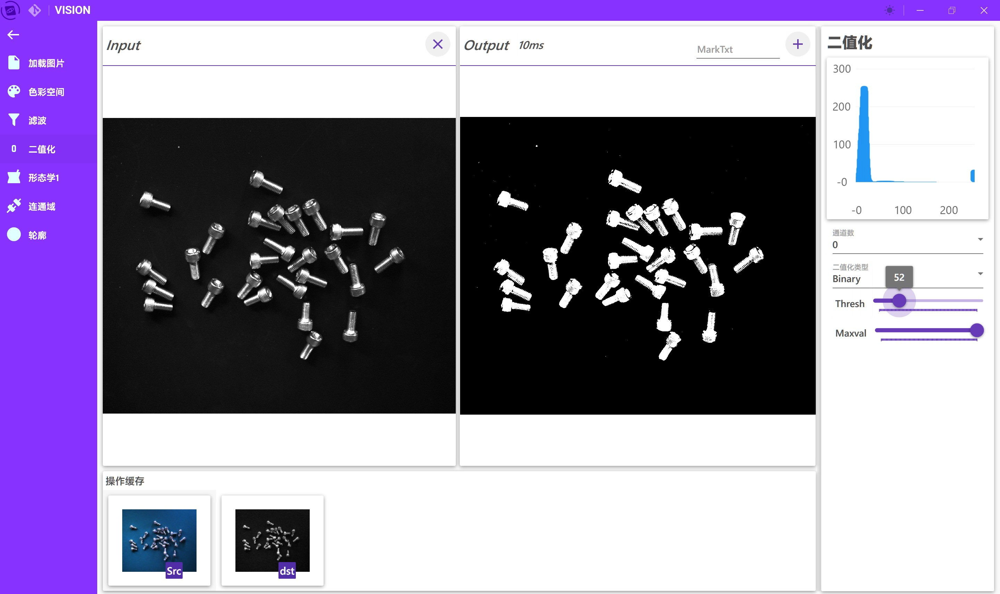
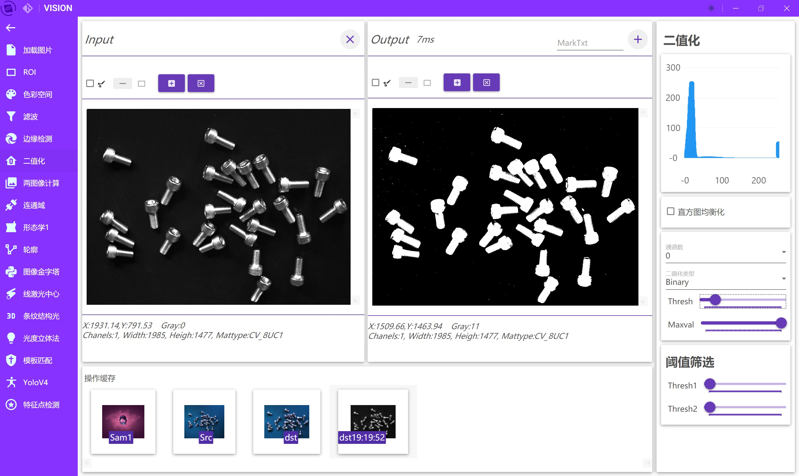
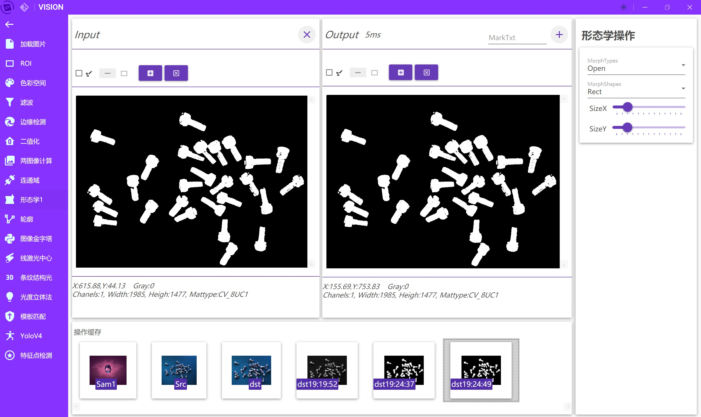
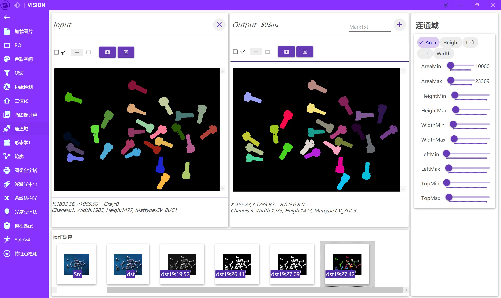
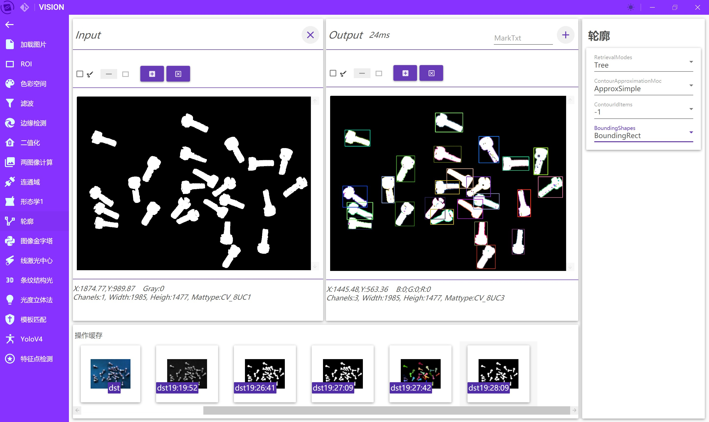
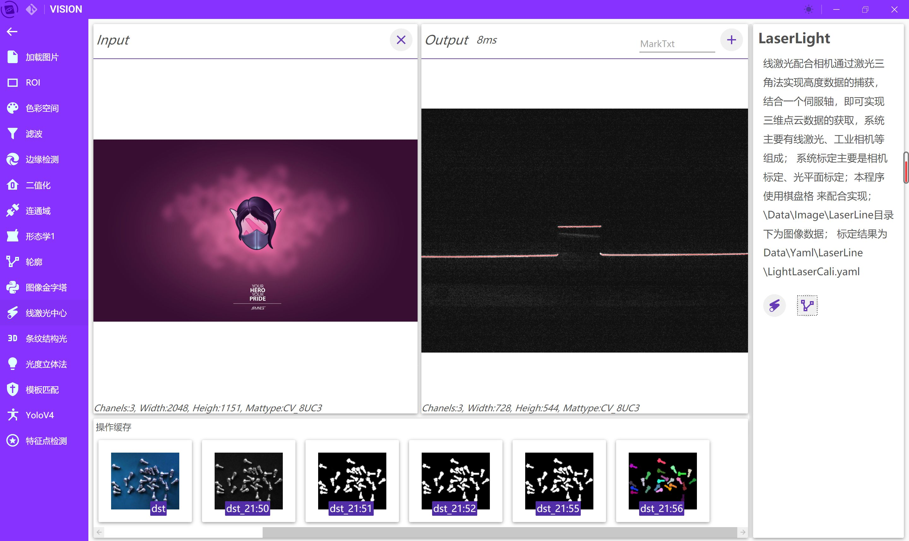
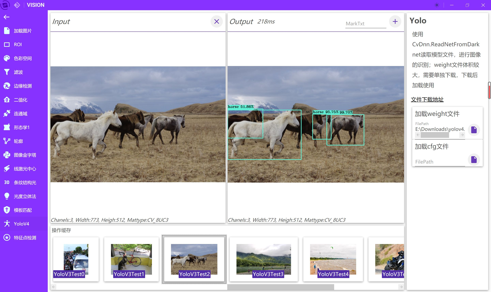

# OpencvVision
## 是什么？
这是一个使用.net 6基于OpencvSharp、ReactiveUI开发的自用工具，主要用来做ReactiveUI与OpencvSharp学习过程中的尝试；根据个人需求不定期更新添加功能，欢迎讨论交流。

### ！其他信息请参考项目Client.View内AppBootstrapper.cs文件里的相关说明

## 引用
|功能|引用包|
|--|--|
|OpencvSharp|[OpencvSharp](https://github.com/shimat/opencvsharp_samples)|
|MVVMk框架|[ReactiveUI](https://github.com/reactiveui/ReactiveUI)|
|界面控件|[MaterialDesignInXamlToolkit](https://github.com/MaterialDesignInXAML/MaterialDesignInXamlToolkit) |
|标题栏|[MahApps.Metro](https://github.com/MahApps/MahApps.Metro)|
|响应式集合|[DynamicData](https://github.com/reactivemarbles/DynamicData)|

## 推荐
>交流讨论QQ群:827888895  
其它项目： 
[OpenCVSharpHelper](https://gitee.com/tfarcraw/opencvsharphelper)

## 部分功能截图
首页

夜间模式添加图片

ROI

色彩空间

滤波

二值化

形态学

连通域

轮廓

格雷码条纹结构光

灰度质心线激光

光度立体法求表面法线与深度图

Yolo识别

特征点匹配
